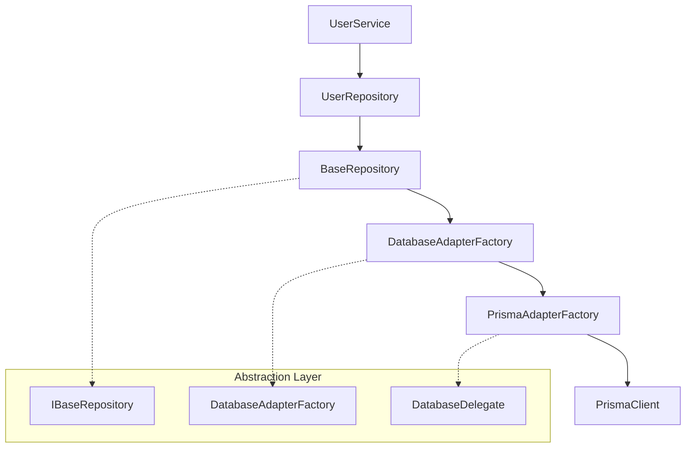

# Repository Factory Pattern 구현 가이드

이 문서는 프로젝트에서 구현된 Repository Factory Pattern의 상세한 구조와 사용법을 설명합니다.

## 📋 목차

- [패턴 개요](#패턴-개요)
- [아키텍처 구조](#아키텍처-구조)
- [핵심 인터페이스](#핵심-인터페이스)
- [구현 상세](#구현-상세)
- [사용법 가이드](#사용법-가이드)
- [확장 방법](#확장-방법)
- [모범 사례](#모범-사례)

## 🎯 패턴 개요

Repository Factory Pattern은 두 가지 디자인 패턴을 조합한 접근 방식입니다:

### Repository Pattern
- **목적**: 데이터 접근 로직을 비즈니스 로직에서 분리
- **장점**: 테스트 용이성, 코드 재사용성, 유지보수성 향상
- **구현**: 추상 인터페이스를 통한 데이터 계층 추상화

### Factory Pattern
- **목적**: 다양한 Repository 구현체의 생성과 관리
- **장점**: ORM 독립성, 확장 가능성, 설정 중앙화
- **구현**: DatabaseAdapterFactory를 통한 어댑터 생성

## 🏛️ 아키텍처 구조



### 레이어별 책임

| 레이어 | 책임 | 구현 파일 |
|--------|------|-----------|
| **Service Layer** | 비즈니스 로직, 트랜잭션 관리 | `user.service.ts` |
| **Repository Layer** | 데이터 접근 추상화, CRUD 작업 | `user.repository.ts`, `base.repository.ts` |
| **Factory Layer** | 어댑터 생성 및 관리 | `prisma-adapter.factory.ts` |
| **Adapter Layer** | ORM 구체 구현 | DatabaseDelegate 구현체 |

## 🔧 핵심 인터페이스

### IBaseRepository<T, CreateDto, UpdateDto>

모든 Repository가 구현해야 하는 기본 계약입니다.

```typescript
export interface IBaseRepository<T, CreateDto, UpdateDto> {
  // 단일 조회
  findById(id: string | number): Promise<T | null>;
  findOne(where: Partial<T>): Promise<T | null>;
  findOneWithOptions(options?: QueryOptions<T>): Promise<T | null>;

  // 다중 조회
  findAll(options?: QueryOptions<T>): Promise<T[]>;
  findMany(where: Partial<T>): Promise<T[]>;
  findAllPaginated(options: QueryOptions<T>): Promise<PaginatedResult<T>>;

  // 생성/수정/삭제
  create(data: CreateDto): Promise<T>;
  update(id: string | number, data: UpdateDto): Promise<T>;
  delete(id: string | number): Promise<void>;

  // 유틸리티
  count(where?: Partial<T>): Promise<number>;
  exists(id: string | number): Promise<boolean>;
}
```

### DatabaseDelegate

ORM 독립적인 데이터베이스 작업을 정의하는 인터페이스입니다.

```typescript
export interface DatabaseDelegate {
  findUnique: (args: any) => Promise<any>;
  findFirst: (args: any) => Promise<any>;
  findMany: (args: any) => Promise<any>;
  count: (args: any) => Promise<number>;
  create: (args: { data: any }) => Promise<any>;
  update: (args: { where: any; data: any }) => Promise<any>;
  delete: (args: { where: any }) => Promise<any>;
  // ... 기타 CRUD 메서드
}
```

## 🔨 구현 상세

### 1. BaseRepository 추상 클래스

```typescript
@Injectable()
export abstract class BaseRepository<T, CreateDto, UpdateDto>
  implements IBaseRepository<T, CreateDto, UpdateDto>
{
  protected abstract readonly modelName: string;
  private _database?: DatabaseDelegate;

  constructor(
    @Inject(DATABASE_ADAPTER_FACTORY)
    protected readonly adapterFactory: DatabaseAdapterFactory,
    @Inject(DEFAULT_LIMIT_TOKEN)
    protected readonly defaultLimit: number = 20,
  ) {}

  protected get database(): DatabaseDelegate {
    if (!this._database) {
      this._database = this.adapterFactory.createAdapter(this.modelName);
    }
    return this._database;
  }

  // CRUD 메서드 구현...
}
```

#### 핵심 특징
- **Lazy Loading**: 데이터베이스 어댑터는 처음 사용 시에만 생성
- **타입 안전성**: 제네릭을 통한 강력한 타입 검사
- **설정 가능**: 모듈 레벨에서 기본값 설정 가능

### 2. UserRepository 구체 구현

```typescript
@Injectable()
export class UserRepository extends BaseRepository<User, CreateUserDto, UpdateUserDto> {
  protected readonly modelName = 'User';

  constructor(
    @Inject(DATABASE_ADAPTER_FACTORY)
    adapterFactory: DatabaseAdapterFactory,
    @Optional() @Inject(DEFAULT_LIMIT_TOKEN)
    defaultLimit?: number,
  ) {
    super(adapterFactory, defaultLimit);
  }

  // 도메인 특화 메서드
  async findByEmail(email: string): Promise<User | null> {
    return this.findOne({ email });
  }
}
```

### 3. PrismaAdapterFactory 구현

```typescript
@Injectable()
export class PrismaAdapterFactory extends DatabaseAdapterFactory {
  constructor(private readonly databaseClient: PrismaService) {
    super();
  }

  createAdapter(modelName: string): DatabaseDelegate {
    const modelKey = modelName.toLowerCase();
    const adapter = this.databaseClient[modelKey];

    if (!adapter) {
      throw new Error(`Database model '${modelName}' not found`);
    }

    return adapter;
  }
}
```

## 📖 사용법 가이드

### 1. 기본 CRUD 작업

```typescript
@Injectable()
export class UserService {
  constructor(private readonly userRepository: UserRepository) {}

  // 사용자 생성
  async createUser(userData: CreateUserDto): Promise<User> {
    return this.userRepository.create(userData);
  }

  // 사용자 조회
  async getUserById(id: string): Promise<User | null> {
    return this.userRepository.findById(id);
  }

  // 페이지네이션 조회
  async getUsers(page: number = 1): Promise<PaginatedResult<User>> {
    return this.userRepository.findAllPaginated({
      page,
      limit: 10,
      orderBy: [{ filter: 'createAt', direction: 'desc' }]
    });
  }
}
```

### 2. 쿼리 옵션 활용

```typescript
// 복합 쿼리 예제
const users = await userRepository.findAllPaginated({
  page: 1,
  limit: 20,
  where: { name: { contains: '김' } },
  include: { posts: true },
  orderBy: [
    { filter: 'createAt', direction: 'desc' },
    { filter: 'name', direction: 'asc' }
  ]
});
```

### 3. 도메인 특화 메서드

```typescript
// UserRepository의 도메인 특화 메서드 사용
const user = await userRepository.findByEmail('user@example.com');

// 존재 여부 확인
const exists = await userRepository.existsBy({ email: 'user@example.com' });
```

## 🚀 확장 방법

### 1. 새로운 Repository 추가

```typescript
@Injectable()
export class PostRepository extends BaseRepository<Post, CreatePostDto, UpdatePostDto> {
  protected readonly modelName = 'Post';

  constructor(
    @Inject(DATABASE_ADAPTER_FACTORY)
    adapterFactory: DatabaseAdapterFactory,
  ) {
    super(adapterFactory);
  }

  // Post 특화 메서드
  async findByAuthor(authorId: number): Promise<Post[]> {
    return this.findMany({ authorId });
  }

  async findPublished(): Promise<Post[]> {
    return this.findMany({ published: true });
  }
}
```

### 2. 새로운 ORM 지원 추가

```typescript
// MongoDB 어댑터 예제
@Injectable()
export class MongoAdapterFactory extends DatabaseAdapterFactory {
  constructor(private readonly mongoClient: MongoClient) {
    super();
  }

  createAdapter(modelName: string): DatabaseDelegate {
    const collection = this.mongoClient.db().collection(modelName.toLowerCase());
    
    return {
      findUnique: (args) => collection.findOne(args.where),
      findMany: (args) => collection.find(args.where).toArray(),
      create: (args) => collection.insertOne(args.data),
      // ... 기타 메서드 매핑
    };
  }
}
```

### 3. 트랜잭션 지원

```typescript
@Injectable()
export class TransactionalUserRepository 
  extends TransactionalBaseRepository<User, CreateUserDto, UpdateUserDto> {
  
  async createUserWithPosts(userData: CreateUserDto, postsData: CreatePostDto[]) {
    return this.withTransaction(async (repo) => {
      const user = await repo.create(userData);
      
      for (const postData of postsData) {
        await this.postRepository.create({ ...postData, authorId: user.id });
      }
      
      return user;
    });
  }
}
```

## ✨ 모범 사례

### 1. Repository 설계 원칙

#### ✅ 좋은 예시
```typescript
// 도메인 특화 메서드 제공
async findActiveUsers(): Promise<User[]> {
  return this.findMany({ status: 'active' });
}

// 명확한 메서드 네이밍
async findByEmailAndStatus(email: string, status: string): Promise<User | null> {
  return this.findOne({ email, status });
}
```

#### ❌ 피해야 할 예시
```typescript
// 너무 일반적인 메서드
async findSome(criteria: any): Promise<User[]> {
  return this.findMany(criteria);
}

// 비즈니스 로직이 Repository에 들어간 경우
async promoteUser(userId: number): Promise<void> {
  // 비즈니스 로직은 Service에서!
  const user = await this.findById(userId);
  await this.sendPromotionEmail(user.email);
  await this.update(userId, { role: 'premium' });
}
```

### 2. 에러 처리

```typescript
// Service 레벨에서 도메인별 에러 처리
async createUser(userData: CreateUserDto): Promise<User> {
  try {
    return await this.userRepository.create(userData);
  } catch (error) {
    if (error.code === 'P2002') { // Prisma unique constraint
      throw new ConflictException('이미 존재하는 이메일입니다');
    }
    throw error;
  }
}
```

### 3. 타입 안전성

```typescript
// 강력한 타입 지원
interface UserQueryOptions extends QueryOptions<User> {
  where?: {
    email?: string;
    name?: { contains: string };
    status?: 'active' | 'inactive';
  };
}

async findUsers(options: UserQueryOptions): Promise<User[]> {
  return this.userRepository.findAll(options);
}
```

## 🔍 디버깅 및 모니터링

### 로깅 추가
```typescript
// BaseRepository에 로깅 추가
async create(data: CreateDto): Promise<T> {
  console.log(`🔍 Creating ${this.modelName}:`, data);
  const result = await this.database.create({ data });
  console.log(`✅ Created ${this.modelName}:`, result.id);
  return result;
}
```

### 성능 모니터링
```typescript
// 쿼리 실행 시간 측정
protected async executeQuery<TResult>(
  operation: () => Promise<TResult>,
  operationName: string
): Promise<TResult> {
  const start = Date.now();
  try {
    const result = await operation();
    console.log(`⚡ ${operationName} completed in ${Date.now() - start}ms`);
    return result;
  } catch (error) {
    console.error(`❌ ${operationName} failed after ${Date.now() - start}ms:`, error);
    throw error;
  }
}
```

---

**참고 문서**:
- [프로젝트 인덱스](./PROJECT_INDEX.md)
- [Prisma 설정 가이드](./PRISMA_SETUP.md)
- [API 레퍼런스](./API_REFERENCE.md) *(생성 예정)*